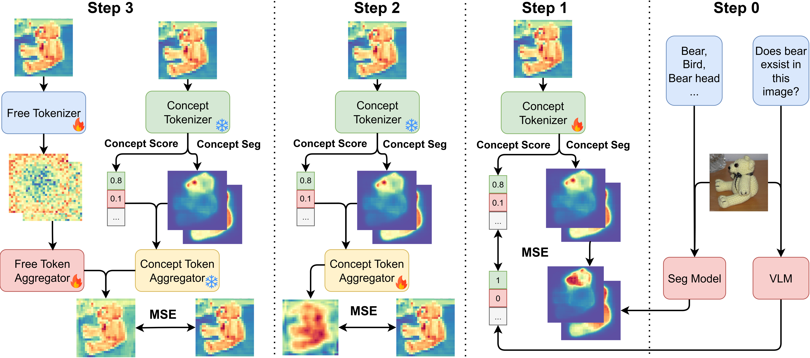

<div align="center">
  <h2><b>Concept-SAE: Active Causal Probing of Visual Model Behavior</b></h2>
  <h4><b>Jianrong Ding*, Muxi Chen*, Chenchen Zhao, Qiang Xu†</b></h4>

[](https://arxiv.org/abs/2509.22015)  

</div>
<br>




### Data

Download ImageNet and CelebA datasets and put them under ```step1-3/data/datasets``` and ```step0/images``` respectively.

### Step 0

Generate concept segmentation and concept score through ClipSeg and VLM separatedly. Go to ```step0``` directory.

```bash
python get_score.py

python get_segment.py
```
Then move ```segs_celeba``` and ```segs_imagenet``` to ```step1-3``` directory.

### Step 1-3

First, switch to ```step1-3``` directory. If you would like to train with ResNet18, then use the following code.
```bash
python step1.py --node $node --task $task
# $node is the layer number of ResNet18 for Concept-SAE to learn
# $task is the dataset name, it can be chosen from [imagenet, celeba]

python step2.py --node $node --task $task

python step3.py --node $node --task $task
```
For ViT, use the following code.
```bash
python step1_clip.py --node $node --task $task
# $node is the layer number of ViT for Concept-SAE to learn
# $task is the dataset name, it can be chosen from [imagenet, celeba]

python step2_clip.py --node $node --task $task

python step3_clip.py --node $node --task $task
```

### Citation

If you find our work helpful, please cite our paper.
```
@article{ding2025concept,
  title={Concept-SAE: Active Causal Probing of Visual Model Behavior},
  author={Ding, Jianrong and Chen, Muxi and Zhao, Chenchen and Xu, Qiang},
  journal={arXiv preprint arXiv:2509.22015},
  year={2025}
}
```
